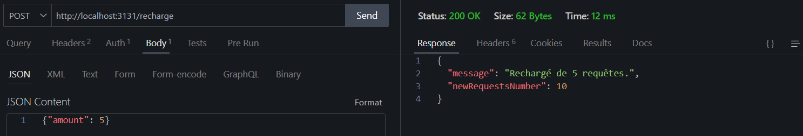

# TP Express.js – API avec Authentification par Token et Limite de Requêtes

Ce projet est une API simple développée avec **Express.js** qui illustre les concepts suivants :

- Authentification par token
- Limitation du nombre de requêtes par utilisateur
- Système de recharge avec limitation par adresse IP
- Routes REST pour la gestion d’items (CRUD)

---

## Technologies utilisées
- Node.js
- Express.js
- UUID
- Middleware personnalisé pour la gestion des quotas

## Installation

```bash
  SSH        : git clone https://github.com/ElazzouziHassan/rest-api.git
  HTTPS      : git clone git@github.com:ElazzouziHassan/rest-api.git
  cd rest-api
  npm install
```

- **Note importante**
Ne pas oublier de créer le fichier  `.env` avec les variables d'environnement suivant :
```xml
  PORT=3131
  JWT_SECRET=Token_générer
  TOKEN_EXPIRATION=1h
```
- Utiliser la commande suivante dans la ligne de commande (terminal) pour générer un token :
  ```bash
    node -e "console.log(require('crypto').randomBytes(32).toString('hex'))"
  ```
- **démarrer le serveur**
```bash
  npm start
```
Le serveur démarre par défaut sur `http://localhost:3131`

## Test Postman/ Thunder Client :
```xml
  Méthode          :  GET
  URL              : http://localhost:3131/ping
  Résultat attendu :  {"message":"Hello From API !"}
```


## Authentification :

### Enregistrement :

Permet d’obtenir un token et un quota de requêtes (10 par défaut).

```xml
  Méthode : POST 
  URL     : http://localhost:3131/register
```

*Réponse* :
```xml
  {
    "token": "...",
    "requestsNumber": 10,
    "message": "Enregistrement réussi. Vous avez 10 requêtes."
  }
```


### Ajouter un item :

```xml
  Méthode : POST 
  URL     : http://localhost:3131/items
  En-tête :  Authorization: Bearer <token>
```

*Body JSON* :
```xml
  { "name": "Stylo", "price": 2.5 }
```


### Modifier un item :

```xml
  Méthode : PUT 
  URL     : http://localhost:3131/items/:id
  En-tête :  Authorization: Bearer <token>
```

*Body JSON* :
```xml
  { "price": 3 }
```


###  Liste des items :

```xml
  Méthode : GET
  URL     : http://localhost:3131/items
  En-tête :  Authorization: Bearer <token>
```
###  Supprimer un item :

```xml
  Méthode : DELETE
  URL     : http://localhost:3131/items/:id
  En-tête :  Authorization: Bearer <token>
```


### Limitation par IP (Recharger les requêtes) :

Recharge le quota de requêtes de l’utilisateur (par défaut 5 requêtes).
Limité à 5 appels par heure et par IP.

```xml
  Méthode : POST
  URL     : http://localhost:3131/recharge
  En-tête :  Authorization: Bearer <token>
```
- **Body JSON**
```xml
  { "amount": 5 }
```


## Fonctionnement

- Chaque utilisateur reçoit un token unique à l’enregistrement.
- Chaque requête consomme 1 crédit (sauf `/ping`, `/register`, `/recharge`).
- Si le quota tombe à 0, l’accès est refusé (code 429 Too Many Requests).
- Le système de recharge vérifie et limite les appels par IP (5 maximum par heure).


---
## Auteur
Projet réalisé dans le cadre d’un TP sur Express.js – Université Chouaib Doukkali – Master 2IAD
Développeur : EL AZZOUZI HASSAN

